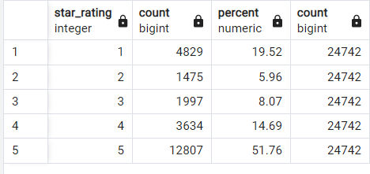

# Amazon_Vine_Analysis

## Overview of the analysis of the Vine program:

The purpose of this assignment was to review the products of the Amazon Vine project and provide an analysis of the reviews provided. 

## Results:

Using the automotives dataset, we were able to clean the data up given the below criteria: 
  - Items that had less than 20 votes
  - Helpfulness of the votes determined to be less than 50% 
  - Split into Vine Subcribers and Non Subscribers 
  
The Vine Subscribers were as follows: 

The Non Vine Subscribers were as follows: 

- How many Vine reviews and non-Vine reviews were there?

There was a total of 82 vine reviews vs 24,742 non-vine reviews 

- How many Vine reviews were 5 stars? How many non-Vine reviews were 5 stars?

Vine reviews had 33 5-star reviews. Non-vine reviews had 12,807 5-star reviews 

- What percentage of Vine reviews were 5 stars? What percentage of non-Vine reviews were 5 stars?

40% of Vine Reviews were 5-star reviews while 52 % of Non-Vine Reviews were 5-stars. 

## Summary:

It is difficult to determine whether there is bias. On one hand, it does appear that vine reviewers are less likely to give 1-2 stars than non vine reviews, which would show more honest reviews by the non vine reviews. That being said, there is significantly less data in that data set. It is unknown if that subset was bigger whether it would be the same. Ignoring that the population size is so small, it would show that there is some bias amongst the vine users. 

To expand this analysis, we should increase the subset of data of the vine users to see the data normalizes. If it does, it would show lesser bias than the current. We could also attempt to segregate out more data with the other tables created in this module. It would be interesting to understand more about the products itself and see if would sub categorize it further to see bias existed in specific categories. 

